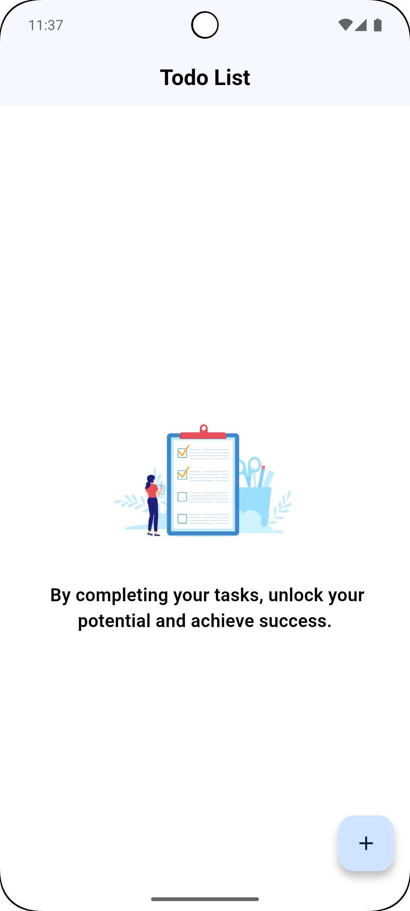
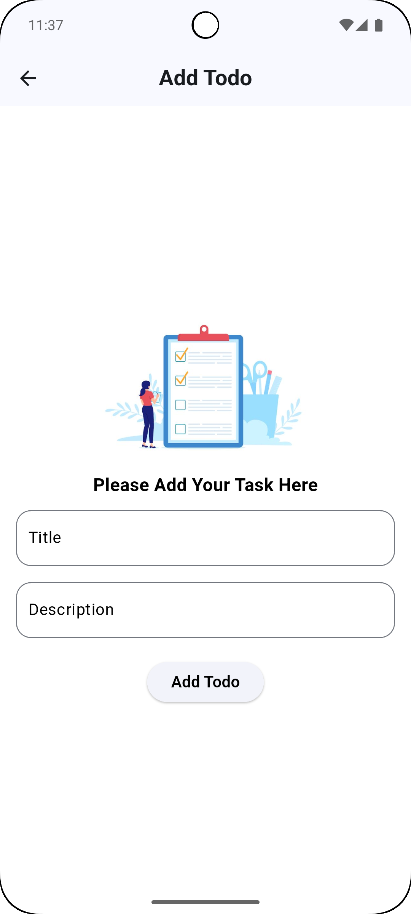
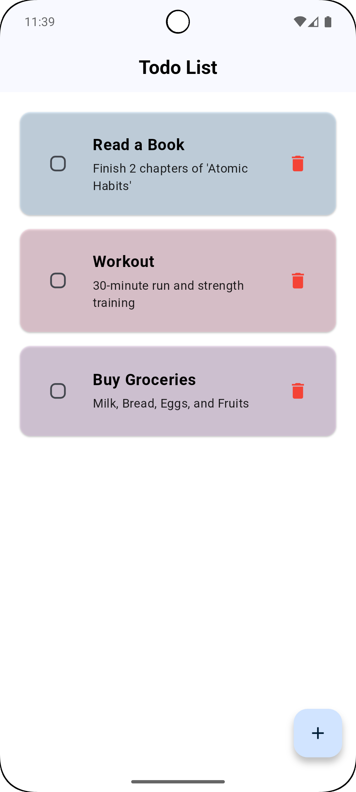

📋 Todo App 📝 (Flutter + Hive)
A minimalist and lightweight Todo App built with Flutter, featuring:
✅ Persistent storage using Hive
✅ Random colors for each task
✅ Task completion tracking
✅ Modern & Clean UI

🚀 Features
✅ Add Todos → Create tasks with a random light color
✅ Mark as Done → Tap to complete (strikethrough effect)
✅ Delete Todos → Remove tasks easily
✅ Persistent Storage → Uses Hive for local storage

## 📸 Screenshots

### ✅ Home Screen Empty

### ✅ TODO add Screen

### ✅ Home Screen

🛠 Future Improvements
🔹 Add animations for task completion
🔹 Implement dark mode
🔹 Sync data with Firebase